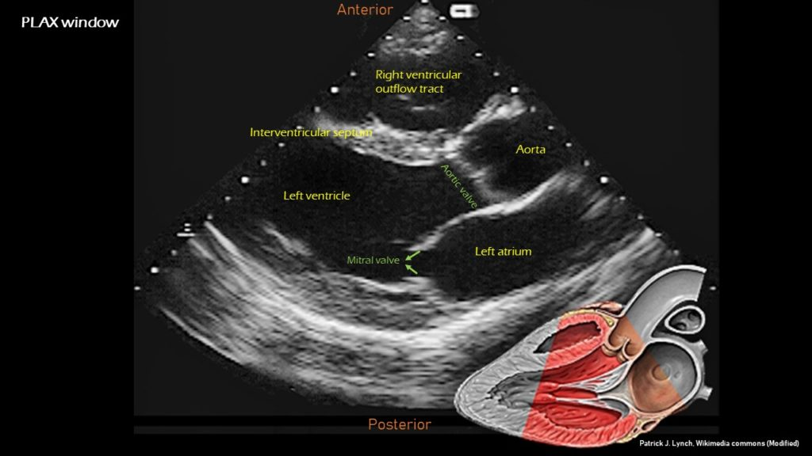
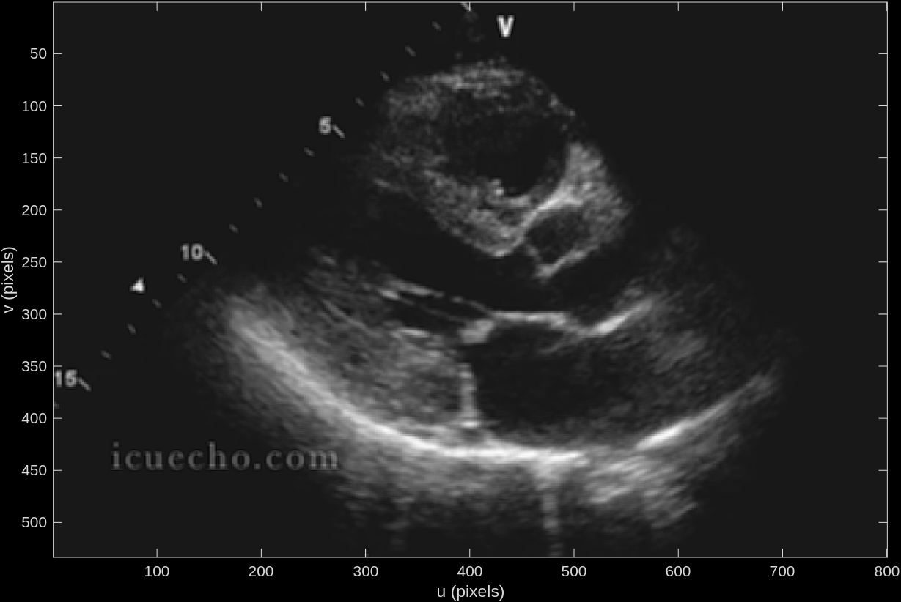
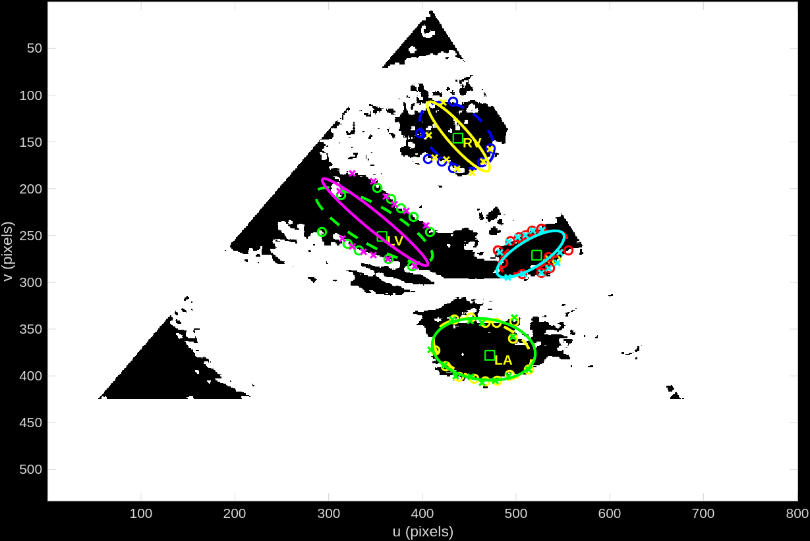
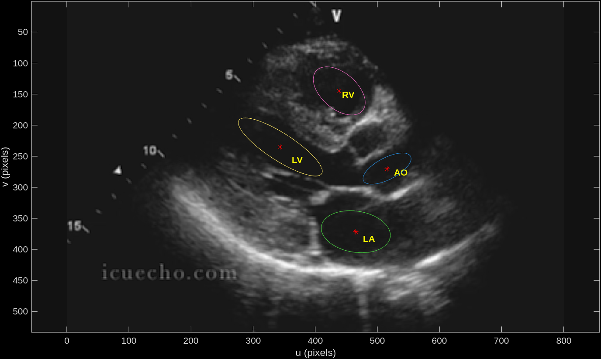

# Ultrasound Processing Module

Simple Matlab module to handle the image recognition portion of an automated cardiac ultrasound acquisition robot.
This is a rudimentary approach using basic computer vision techniques to compare ultrasound scans of a PLAX view to a data set of what we would expect to see in a PLAX view.

Human determination of whether an ultrasound is appropriate follows a set of criteria:
- Does the image contain all the key features of the view?
- Are the key features the correct shape?
- Is there occlusion / a shadow cast by the ribs?
- Is the image centered/framed correctly?
- Is the image sharp enough? (not too blurry)

<br/>
<br/>


> Labelled PLAX scan [^1]
 
[^1]: https://www.renalfellow.org/2019/06/07/introduction-to-focused-cardiac-ultrasound-the-parasternal-long-axis-view/

<br/>
<br/>

This module aims to perform a number of steps to cover all of these criteria:
- Identify where we expect the centroid of key features to be
- Build an ellipse of best fit for each of these key features and compare it to the expected values
- Determine image suitability: (criteria)
    - Are all key feature ellipses present in the image? (1,3,4)
    - Are the key feature shapes appropriate? (2,3,4)
    - Is the overall sharpness of the image within acceptable thresholds? (5)

<br/>

## Example:
##### Input image:


##### First pass creating approximate feature areas:


##### Output image:


<br/>

##### Output values
    - major axis length
    - minor axis length
    - normalized axis length (major relative to minor)
    - orientation
    - area

These values are used to create a confidence value for each key feature in the image.

```
    normalized size = minor axis / major axis
    
    shape = (abs(1-(expected size / normalized size)) + abs(1-(expected orientation / orientation))) * shape found (0 = no, 1 = yes)

    confidence score = average( key feature shape values )
```
Scores closest to 0 represent the most accurate scan to the data set.

#### Requirements: (as of last update, intended to be reduced as the project progresses)
    - Computer Vision Toolbox
    - Peter Corke's Machine Vision Toolbox
    - Image Processing Toolbox
    - Statistics and Machine Learning Toolbox


#### Credits
    - Nikolai Chernov (2026). Ellipse Fit (Direct method) (https://uk.mathworks.com/matlabcentral/fileexchange/22684-ellipse-fit-direct-method), MATLAB Central File Exchange. Retrieved February 4, 2026. 
    - Nima Moshtagh (2026). Minimum Volume Enclosing Ellipsoid (https://uk.mathworks.com/matlabcentral/fileexchange/9542-minimum-volume-enclosing-ellipsoid), MATLAB Central File Exchange. Retrieved February 4, 2026. 
    - Nima Moshtagh (2026). Plot an ellipse in "center form" (https://uk.mathworks.com/matlabcentral/fileexchange/13844-plot-an-ellipse-in-center-form), MATLAB Central File Exchange. Retrieved February 4, 2026. 